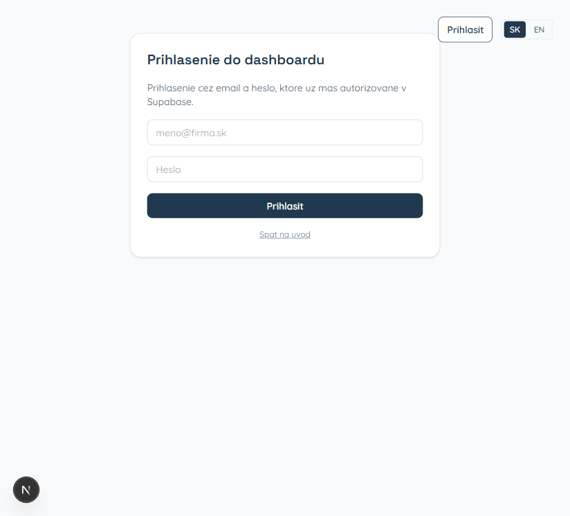
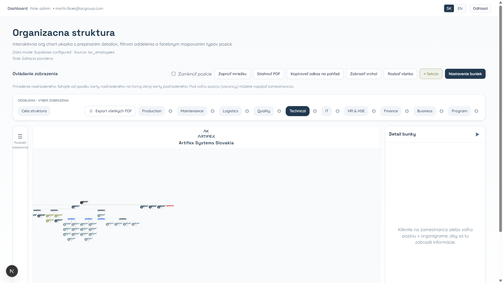
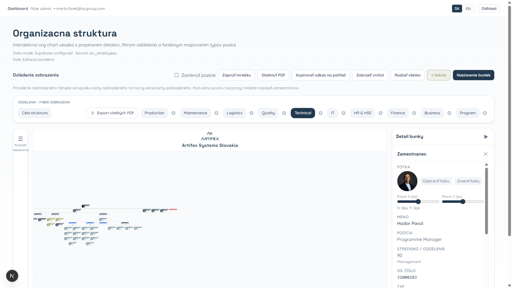
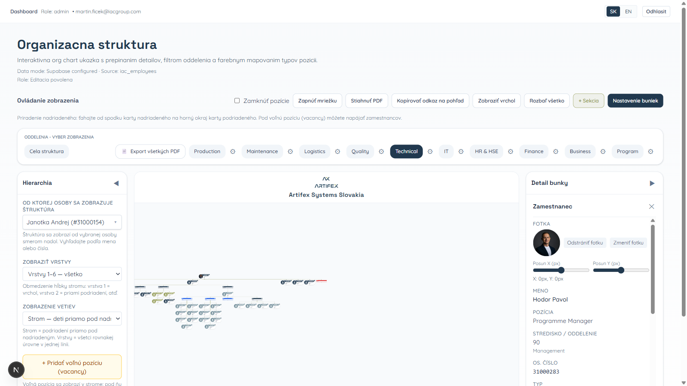
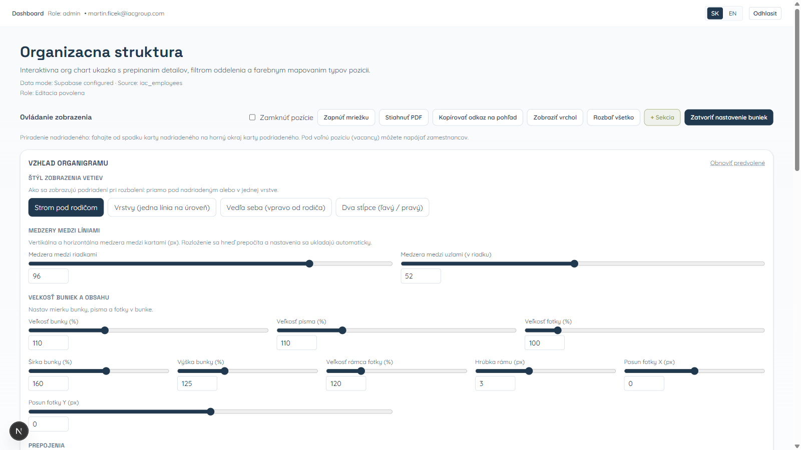

# Používateľská príručka — Organigram

Aplikácia slúži na **prehliadanie organizačnej štruktúry** firmy — strom ľudí a pozícií, oddelenia a základné úpravy podľa toho, čo vám povolia oprávnenia.

---

## Prihlásenie

1. Zadajte **e-mail**, ktorý používate na prácu (ten, čo máte od firmy).
2. Zadajte **heslo**.
3. Stlačte **Prihlásiť**.

Vpravo hore môžete prepnúť jazyk rozhrania (**SK** / **EN**).

---

## Horný pruh

Po prihlásení hore uvidíte, že ste v **Dashboarde**, prípadne aj vašu rolu a e-mail. Ak niečo **nemôžete meniť**, máte len prehliadanie — ostatní používatelia môžu mať viac možností.

**Odhlásiť** — vpravo hore, keď končíte prácu (najmä na zdieľanom počítači).

---

## Hlavná obrazovka — organigram

Stred obrazovky je **organigram**: karty ľudí prepojené čiarami podľa nadriadených.

- **Posun** po ploche: podržte ľavé tlačidlo myši a ťahajte.
- **Priblíženie / oddialenie**: koliesko myši alebo malé tlačidlá pri okraji diagramu.
- **Klik na osobu** — vpravo sa otvorí **detail** (meno, pozícia, oddelenie a pod.).

### Tlačidlá nad diagramom

Stručne čo robia:

| Tlačidlo | Na čo slúži |
|----------|-------------|
| **Zamknúť pozície** | Zabráni posúvaniu kariet, keď nechcete nič omylom pohnúť |
| **Mriežka** | Pomôcka na pekné zarovnanie |
| **Stiahnuť PDF** | Uloží aktuálny pohľad ako PDF |
| **Kopírovať odkaz** | Odkaz na rovnaký pohľad (priblíženie, rozbalenie), môžete niekomu poslať |
| **Zobraziť vrchol** | Návrat hore v štruktúre |
| **Rozbaliť všetko** | Rozbalí vetvy stromu |
| **+ Sekcia** | Pridanie sekcie (ak vám to systém dovolí) |
| **Nastavenie buniek** | Farby, veľkosti, čiary — ako organigram vyzerá |

**Zmena nadriadeného:** od spodného okraja karty nadriadeného ťahajte k hornému okraju karty podriadeného. Pod **voľné miesto** v štruktúre viete napojiť človeka.

### Oddelenia

Pod týmto panelom sú **záložky oddelení** (napr. Production, IT…). Kliknutím zobrazíte len vybraný útvar alebo celú firmu — podľa toho, čo je na obrazovke označené.

---

## Detail osoby (vpravo)

Po kliknutí na kartu v diagrame sa vpravo zobrazia údaje o osobe. Podľa oprávnení môžete napríklad doplniť alebo zmeniť **fotku**, **farbu karty** alebo **poradie ľudí** pod sebou.

---

## Ľavý panel „Nastavenia“

Tlačidlo s **troma čiarami** vľavo (**Rozbaliť nastavenia**) otvorí bočný panel. Tam môžete napríklad:

- zmeniť, **od koho** sa má štruktúra ukazovať (od ktorého človeka „dole“),
- obmedziť **koľko úrovní** naraz vidíte,
- zvoliť **spôsob rozloženia** vetiev (strom, riadky a pod.),
- pridať **voľné miesto** v štruktúre (voľná pozícia) alebo vrátiť **predvolené nastavenia** šablóny.

---

## Ako vyzerá organigram

Pod **Nastavenie buniek** nájdete veľa možností: veľkosť kariet a písma, farby, štýl čiar medzi ľuďmi a pod. Zatvoríte ich cez **Zatvoriť nastavenie buniek**. Ak niečo nemeníte, stačí túto časť neotvárať.

---

## Užitočné

- **Späť** po úprave: **Ctrl+Z** (Windows) alebo **Cmd+Z** (Mac) — ak práve nepíšete do textového poľa.

---

## Odhlásenie

Vpravo hore **Odhlásiť** — vždy, keď odchádzate od počítača, ktorý používajú aj iní.
